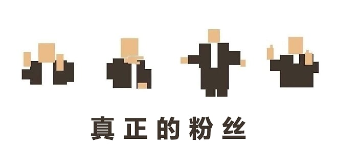
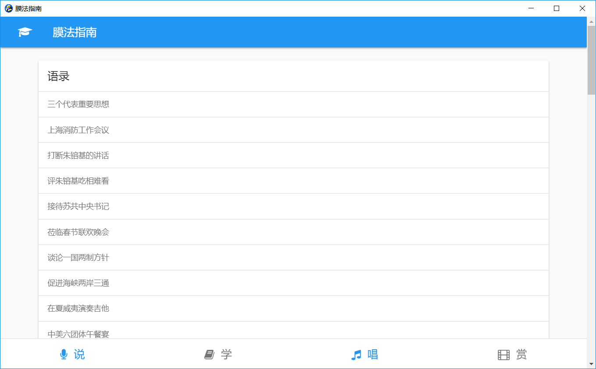
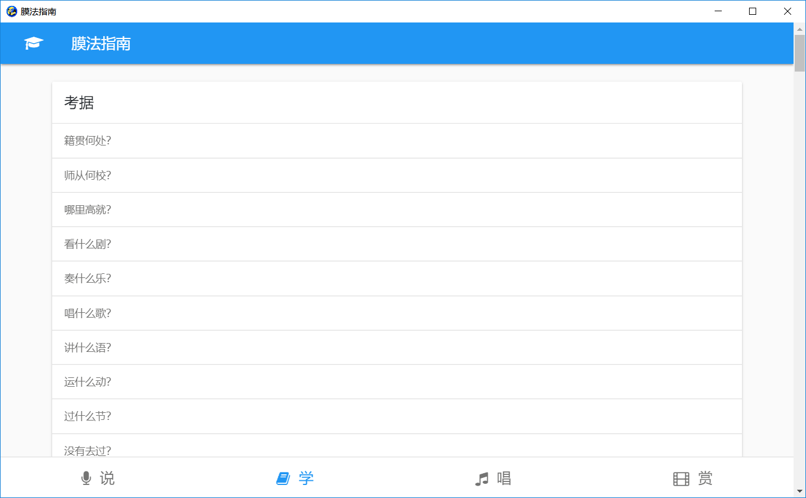
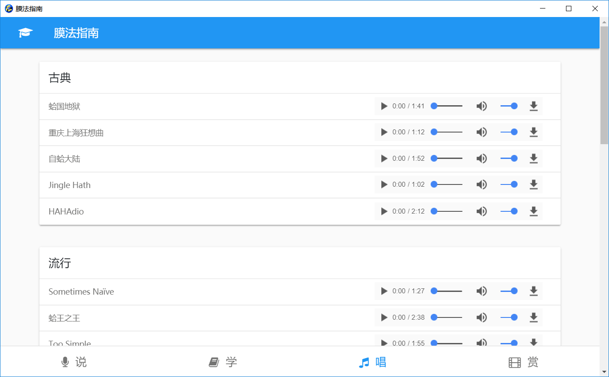
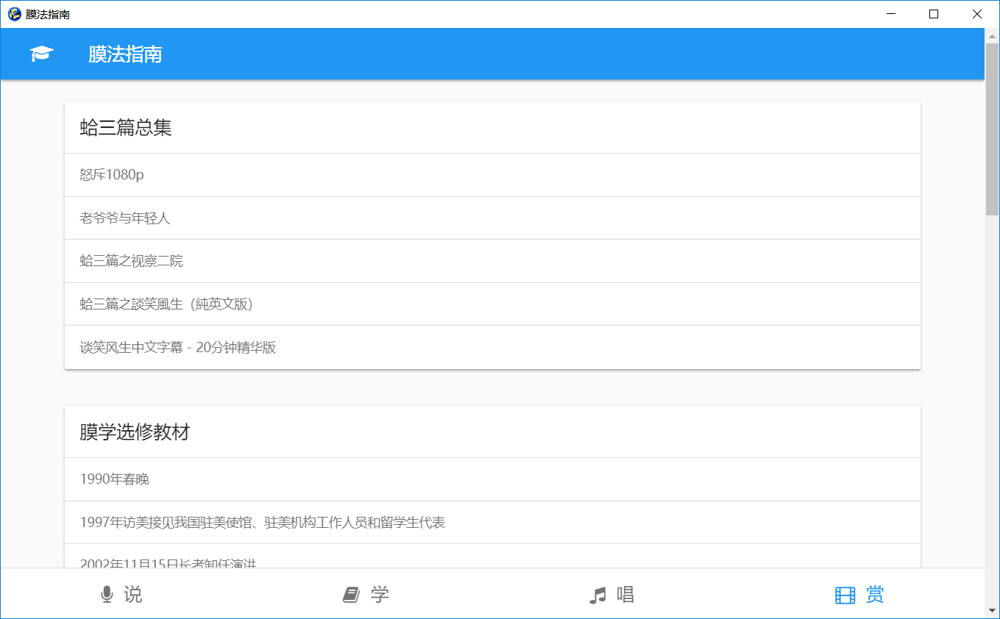
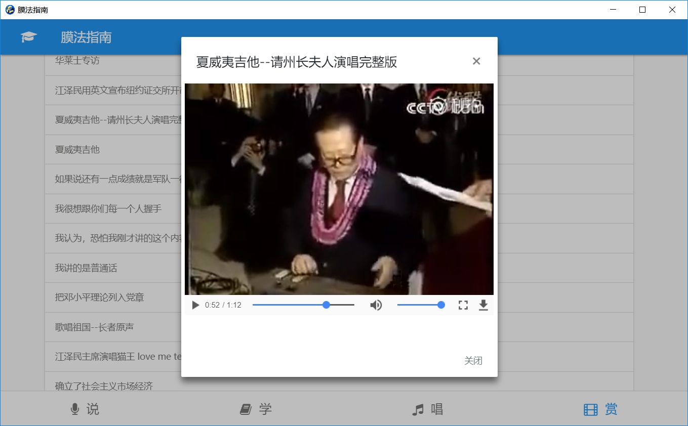

# 膜法指南 网页版

## 简介
科学膜蛤，学习一个，提高姿势水平；

谈笑风生，一派胡言，祝你身体健康。

**[进入 膜法指南 网页版](https://xmader.github.io/mogicians_manual/)**

## 功能
【说】：语录、采访、访问对话、诗词、论文等作品。

【学】：考据、同人、段子、知乎精选等知识。

【唱】：古典、流行、动画等音乐。

【赏】：蛤三篇总集、膜学选修教材 等视频。

## 截屏

## 特别感谢

[【膜法指南】安卓客户端 ](https://github.com/naco-siren/mogicians_manual_public_release)

## 开源许可证

MIT

> 很惭愧，就做了一点微小的工作，谢谢大家

